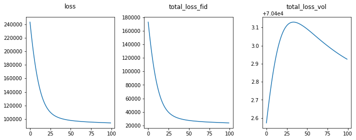
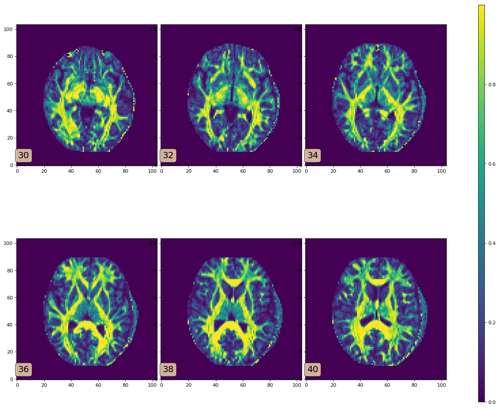

# Single Shell Free Water Elimination Diffusion Tensor Model 

This is a Python implementation of a Single Shell Free Water Elimination Model
the follows the papers listed in the references section below. **This software
is written for educational purposes only and is untested. Please do not use it
for anything important without doing your own testing.**

There is a separate effort by @mvgolub and @RafaelNH to put in an expanded
single shell model into the [Dipy](http://nipy.org/dipy/index.html)
respository. Please follow along at the [Dipy Issue Tracker
#827](https://github.com/nipy/dipy/issues/827). When the Dipy version is ready,
it is likely to be better tested, more user friendly, efficient and have more
features than the version in this repository.

## Software requirements

* Python 3.6.3
* [Dipy 0.14.0](http://nipy.org/dipy/index.html)

## Getting Started

* `git checkout` this repository
* Follow one of the two examples
  * The [example.py](notebooks/example.py) file has an example of how to use this code in a script or pipeline with your own data.
  * The [Example.ipynb](notebooks/Example.ipynb) Jupyter Notebook has an overview of how to use this repository with publicly available data
* Check that the first panel in the loss plots converges

Currently the code has convenience functions to return the `free water map`, the free water corrected `mean diffusivity`, and the free water corrected `Fractional Anisotropy`. 

## Documentation

* This [README](README.md) file has an overview of how to use this repository. 
* The mathematics behind the implementation is written out in the [SingleShellFreewater.pdf](./doc/SingleShellFreeWater.pdf) file. 
* The core of the implementation is in the [freewater.py](./pymods/freewater.py) file. 

## References

* Pasternak, O. , Sochen, N. , Gur, Y. , Intrator, N. and Assaf, Y. (2009), Free water elimination and mapping from diffusion MRI. Magn. Reson. Med., 62: 717-730. doi:[10.1002/mrm.22055](https://doi.org/10.1002/mrm.22055)

* Pasternak O., Maier-Hein K., Baumgartner C., Shenton M.E., Rathi Y., Westin CF. (2014) The Estimation of Free-Water Corrected Diffusion Tensors. In: Westin CF., Vilanova A., Burgeth B. (eds) Visualization and Processing of Tensors and Higher Order Descriptors for Multi-Valued Data. Mathematics and Visualization. Springer, Berlin, Heidelberg doi:[10.1007/978-3-642-54301-2\_11](https://doi.org/10.1007/978-3-642-54301-2_11)

